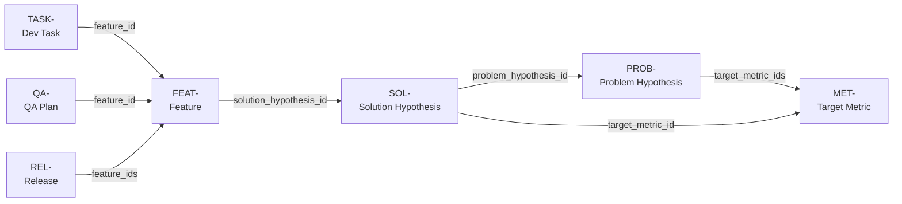

# pet - Product Engineering Toolkit

> Keep the _why_ alive. Every decision from problem to shipped feature, in your repo, in git.

---

When teams use AI to ship faster, they often hit a wall around week six. Simple changes break things unexpectedly. Nobody can explain why a particular approach was chosen, or remember which alternative was tried and abandoned. The code works. The _intent_ has gone missing.

This erosion of captured rationale - what Storey (2026) calls [intent debt](https://arxiv.org/abs/2603.22106) - accumulates silently alongside cognitive debt (the loss of shared understanding across the team). Both accelerate with AI-assisted development. `pet` is a CLI tool that fights both at the source.

## How it works

Three ideas carry the whole system:

**Decisions live in your repo.** Every hypothesis, feature, metric, and release plan is a markdown file with YAML frontmatter under `doc/product/`. Versioned in git, reviewed in PRs, validated by CI. No Notion, no Jira, no separate tool to migrate away from in two years.

**Decisions are immutable.** Once a hypothesis or feature is accepted, its body is never edited. When it turns out to be wrong, you create a new artifact that supersedes it. The full history of what the team believed, and why they believed it, stays forever in git.

**Agents don't carry state.** Each agent invocation reads the current artifacts, computes what should happen next, and takes one step. Same pattern as a Kubernetes controller: read desired state, emit commands to converge. No daemon, no long-running process, no "where are we in the pipeline?" to answer.

`pet` is designed around the [AI Fluency Framework's 4Ds](https://aifluencyframework.org/): **Delegation** (the orchestrator decides which agent acts next), **Description** (artifact bodies are the briefs agents receive), **Discernment** (`pet accept` surfaces a checklist before every HITL gate), and **Diligence** (immutability rules and the audit log keep the full history of what was decided and why).

## Artifact types

Every artifact is a markdown file with YAML frontmatter. The ID prefix tells you what kind it is; the status tells you where it is in its lifecycle.

| Kind                | ID      | Location                              | Lifecycle                                                     |
| ------------------- | ------- | ------------------------------------- | ------------------------------------------------------------- |
| Problem hypothesis  | `PROB-` | `doc/product/00-problem-hypotheses/`  | `proposed -> accepted -> validated/invalidated -> superseded` |
| Target metric       | `MET-`  | `doc/product/01-metrics/`             | `proposed -> accepted -> superseded`                          |
| Solution hypothesis | `SOL-`  | `doc/product/02-solution-hypotheses/` | `proposed -> accepted/rejected -> superseded`                 |
| Feature             | `FEAT-` | `doc/product/03-features/`            | `proposed -> accepted -> released -> superseded`              |
| Dev task            | `TASK-` | `doc/product/04-tasks/`               | `todo -> in_progress -> review -> done`                       |
| QA plan             | `QA-`   | `doc/product/05-qa-plans/`            | `proposed -> accepted -> superseded`                          |
| Release plan        | `REL-`  | `doc/product/06-releases/`            | `proposed -> accepted -> shipped -> superseded`               |

The artifact chain - arrows show which artifact holds the foreign key to which:



CI enforces schema validity, foreign-key integrity, and the immutability rule on accepted artifacts.

Decision artifacts (hypotheses, features, metrics, releases) are immutable after `status: accepted`. Updates happen via supersession: new artifact, old one gets `superseded_by` + status flip. Dev tasks (`TASK-`) are freely mutable through their workflow.

## A cycle in practice

```bash
# You notice checkout abandonment is spiking
pet new hypothesis "Users abandon checkout because shipping cost is shown too late"
# -> creates PROB-0001

pet discover --hypothesis PROB-0001
# -> Researcher fills in evidence; SolutionDesigner drafts SOL-0001

pet accept hypothesis PROB-0001
pet accept solution-hypothesis SOL-0001

pet discover --solution-hypothesis SOL-0001
# -> FeatureDesigner creates FEAT-0001: "Show estimated shipping at product page"

pet accept feature FEAT-0001
pet deliver --feature FEAT-0001
# -> Architect clears architecture; TechLead decomposes into TASK-0001...TASK-0004

# Implement the tasks, then:
pet qa --feature FEAT-0001        # -> QA creates QA-0001 plan
pet new release --features FEAT-0001 "v1.3"
pet release --release REL-0001    # -> DevOps adds deployment checklist
pet accept release REL-0001       # -> ship it
```

Six months later, a new engineer asks: "Why do we show shipping cost on the product page?" They read PROB-0001, SOL-0001, FEAT-0001 - and they know. Not because someone remembered to write a wiki page, but because the pipeline forced the answer to be written down at the moment it was decided.

## Agent hierarchy

```
Orchestrator  (pet / pet chat - interactive dialogue)
├── DeliveryLead
│   ├── Architect    clears architectural review; writes ADRs
│   ├── TechLead     decomposes features into tasks
│   ├── Dev          enriches task body with implementation approach
│   ├── QA           creates QA plan artifact
│   └── DevOps       adds deployment checklist to release
└── DiscoveryLead
    ├── Researcher       fills evidence on a problem hypothesis
    ├── SolutionDesigner drafts SOL- for an accepted PROB-
    ├── FeatureDesigner  drafts FEAT- for an accepted SOL-
    └── Analyst          drafts PROB- for a target metric
```

HITL gates are required before `hypothesis -> accepted`, `qa-plan -> accepted`, and `release -> accepted`. No agent promotes its own output past a gate.

## Stack

- **Runtime:** Node.js 20+ / TypeScript strict
- **Agent harness:** `deepagents` (npm)
- **LLM:** multi-provider via LangChain (`anthropic` default; `openai`, `bedrock`, `vertex`, `ollama` via `PET_LLM_PROVIDER`)
- **Schemas:** Zod · **Frontmatter:** gray-matter · **CLI:** commander
- **Error handling:** `neverthrow` (`Result<T, E>`; no bare `throw`)
- **Build:** esbuild · **Tests:** vitest

## Getting started

```bash
git clone https://github.com/smirnoffmg/pet
cd pet
npm install && npm run build && npm link
```

---

> _Informed by Storey, M.-A. (2026). "From Technical Debt to Cognitive and Intent Debt: Rethinking Software Health in the Age of AI." [arXiv:2603.22106](https://arxiv.org/abs/2603.22106)_

## License

[MIT](./LICENSE)
