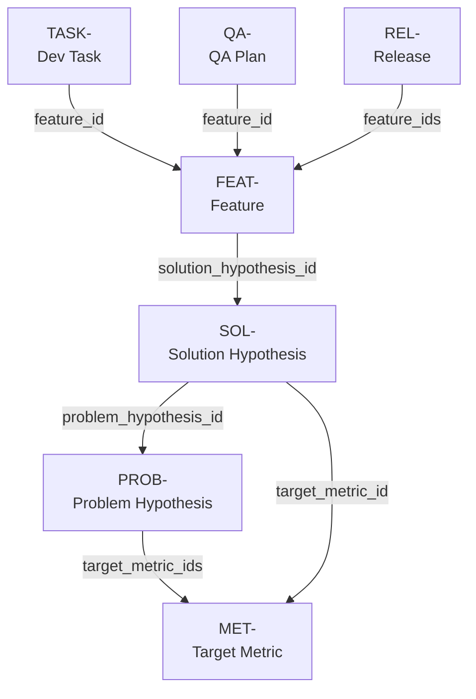

# Product Development Toolkit (pet)

> Agentic product development system. Discovery and delivery cycles run by stateless reconciler agents, with all artifacts living in your repo as version-controlled markdown.

---

## What this is

`pet` is a CLI tool that lets a small team - or one engineer - run an opinionated product development cycle with the help of LLM agents. It models product work as a set of typed artifacts (hypotheses, features, tasks, metrics, releases, ADRs) stored in markdown files in your repo, and runs agents over those artifacts to do work like decomposing features into tasks, drafting hypotheses, validating release plans, and maintaining git hygiene.

The system has three load-bearing ideas:

**Artifacts are documents in the repo.** Everything - hypotheses, features, dev tasks, target metrics, release plans - is a markdown file with YAML frontmatter under `doc/product/`. Versioned in git, reviewed in PRs, validated in CI.

**Decisions are immutable.** Decision-class artifacts (hypotheses, features, metrics, release plans, ADRs) follow ADR principles: once accepted, they are not edited. When a hypothesis turns out to be wrong, you don't rewrite it - you create a new one that supersedes it. The full history of why the team believed what they believed lives in git plus in the artifacts themselves.

**Agents are stateless reconcilers.** No agent holds long-running state about "where we are." Each agent invocation reads the current artifacts, computes the desired state, and emits commands to converge actual toward desired. This is the Kubernetes-controller pattern applied to product work.

## Why this exists

Real product teams lose information in three places: the handoff from PM thinking to Jira ticket (strategic context disappears), the migration from one tool to another (Jira -> Notion -> Confluence -> bankruptcy), and the slow death of decision rationale ("why did we abandon X again?"). Putting everything in the repo, in markdown, behind ADR-style immutability fixes all three. Agents on top of that substrate are useful - but the substrate is the point.

## Architecture

### Artifact types

| Kind                | Class    | ID prefix | Location                                                                | Required frontmatter fields                                                | Optional frontmatter fields                                                                   | Status values                                                           |
| ------------------- | -------- | --------- | ----------------------------------------------------------------------- | -------------------------------------------------------------------------- | --------------------------------------------------------------------------------------------- | ----------------------------------------------------------------------- |
| Target metric       | decision | `MET-`    | `doc/product/01-metrics/`                                               | `id`, `status`                                                             | `supersedes`, `superseded_by`†                                                                | `proposed` -> `accepted` -> `superseded`                                |
| Problem hypothesis  | decision | `PROB-`   | `doc/product/00-problem-hypotheses/`                                    | `id`, `status`, `target_metric_ids[]` (≥1 MET-)                            | `supersedes`, `superseded_by`†                                                                | `proposed` -> `accepted` -> `validated` / `invalidated` -> `superseded` |
| Solution hypothesis | decision | `SOL-`    | `doc/product/02-solution-hypotheses/`                                   | `id`, `status`, `problem_hypothesis_id` (PROB-), `target_metric_id` (MET-) | `rejection_rationale`‡, `supersedes`, `superseded_by`†                                        | `proposed` -> `accepted` / `rejected` -> `superseded`                   |
| Feature             | decision | `FEAT-`   | `doc/product/03-features/`                                              | `id`, `status`, `solution_hypothesis_id` (SOL-)                            | `architectural_review_status` (`pending`/`cleared`/`blocked`), `supersedes`, `superseded_by`† | `proposed` -> `accepted` -> `released` -> `superseded`                  |
| Release plan        | decision | `REL-`    | `doc/product/06-releases/`                                              | `id`, `status`, `feature_ids[]` (≥1 FEAT-)                                 | `supersedes`, `superseded_by`†                                                                | `proposed` -> `accepted` -> `shipped` -> `superseded`                   |
| QA plan             | decision | `QA-`     | `doc/product/05-qa-plans/`                                              | `id`, `status`, `feature_id` (FEAT-)                                       | `supersedes`, `superseded_by`†                                                                | `proposed` -> `accepted` -> `superseded`                                |
| Dev task            | state    | `TASK-`   | `doc/product/04-tasks/` (open) / `doc/product/04-tasks/archive/` (done) | `id`, `status`, `feature_id` (FEAT-)                                       | `completed_at` (ISO datetime), `pr_url`, `commit_sha` (≥7 chars)                              | `todo` -> `in_progress` -> `review` -> `done`                           |

† `superseded_by` requires `status: superseded`. ‡ `rejection_rationale` required when `status: rejected`.

Architecture decisions live in `doc/adr/` in [Michael Nygard format](https://cognitect.com/blog/2011/11/15/documenting-architecture-decisions), compatible with [npryce/adr-tools](https://github.com/npryce/adr-tools). Use `pet new adr` or `adr new` to create them.



Decision artifacts are immutable after `status: accepted`; updates happen via supersession (new artifact, old one gets `superseded_by` + status flip). State artifacts are freely mutable through their workflow.

Every artifact has Zod-validated frontmatter with foreign keys to its parents. CI enforces:

- Schema validity
- FK integrity (no dangling references)
- Immutability of accepted decision artifacts
- One artifact per file
- kebab-case filenames with `NNNN-` numeric prefix

### Agent hierarchy

```
Orchestrator (dialogue - pet / pet chat)
├── DeliveryLead
│   ├── Architect        (clears architectural review; produces ADRs)
│   ├── TechLead         (decomposes features into tasks)
│   ├── Dev              (enriches task body with implementation approach)
│   ├── QA               (creates QA-NNNN plan artifact for a feature)
│   └── DevOps           (enriches release body with deployment checklist)
└── DiscoveryLead
    ├── Researcher        (fills Evidence on a problem hypothesis)
    ├── SolutionDesigner  (drafts SOL- for an accepted PROB-)
    ├── FeatureDesigner   (drafts FEAT- for an accepted SOL-)
    ├── DesignerEnrich    (enriches scaffold feature body)
    └── Analyst           (drafts PROB- for a target metric)
```

Each level is a stateless reconciler. Triggers are explicit (CLI command, git hook, cron) rather than long-running daemons. HITL gates required for: `hypothesis: proposed -> accepted`, `qa-plan: proposed -> accepted`, `release: proposed -> accepted`, production deploys.

The **Orchestrator** is both a deterministic reconciler (used by `pet orchestrate`) and an LLM dialogue agent (used by bare `pet` / `pet chat`). In dialogue mode it can answer questions about the pipeline, spawn subagents, and accept artifacts interactively. See ADR-0024.

The Architect-before-TechLead ordering is enforced: a Feature without `architectural_review_status: cleared` cannot be decomposed into tasks.

### Stack

- **Runtime:** Node.js 20+
- **Language:** TypeScript (strict)
- **Agent harness:** `deepagents` (npm)
- **LLM provider:** `src/llm/provider-factory.ts` - multi-provider via LangChain (`anthropic` default; `openai`, `azure-openai`, `bedrock`, `vertex`, `ollama` selectable via `PET_LLM_PROVIDER`)
- **MCP tool servers:** opt-in - `pet.mcp.json` at repo root; `@modelcontextprotocol/server-memory` pre-configured for `researcher` and `dev` roles
- **Schemas:** Zod
- **Frontmatter:** gray-matter
- **CLI:** commander + @inquirer/prompts
- **File backend:** `FilesystemBackend` from deepagents, pointed at `doc/product/`
- **Validators:** Zod + custom FK-integrity + immutability checks
- **Error handling:** `neverthrow` (`Result<T, E>` types; no bare `throw` in production code)
- **Hooks:** husky
- **Build:** esbuild (single-file CLI bundle)
- **Tests:** vitest

The deepagents `FilesystemBackend` maps the agents' virtual filesystem directly onto the repo's `doc/` tree. There is no separate state store for product knowledge - git is the source of truth.

### MCP tool servers

Agents can connect to external tool servers over the [Model Context Protocol](https://modelcontextprotocol.io) by adding a `pet.mcp.json` file at the repo root. The file is optional; agents run fine without it.

```json
{
  "servers": [
    {
      "name": "memory",
      "transport": "stdio",
      "command": "npx",
      "args": ["-y", "@modelcontextprotocol/server-memory"]
    }
  ]
}
```

Each server entry requires `name` and `transport` (`"stdio"` or `"sse"`):

- **stdio**: `command` (required), `args` (optional array), `env` (optional key-value pairs)
- **sse**: `url` (required - must be a valid URL)

The `memory` server is pre-configured in the committed `pet.mcp.json` and is allow-listed for the `researcher` and `dev` roles. It stores a knowledge graph in a local JSONL file and exposes tools like `create_entities`, `search_nodes`, and `add_observations`. To change where it stores its data, set `MEMORY_FILE_PATH` in the server's `env`:

```json
{ "env": { "MEMORY_FILE_PATH": "/your/path/memory.jsonl" } }
```

Per-role allow-lists live in `src/agents/path-permissions.ts` (`ROLE_MCP_SERVERS` map). Only servers whose name appears in the role's allow-list are connected; all other servers in `pet.mcp.json` are ignored for that role. See ADR-0023 for the design.

### Runtime model

Local-only. Every invocation runs on the developer's machine, uses their git config and API keys, and writes to their working copy. No server, no shared infrastructure. Session state lives outside the repo in `~/.local/share/pet/<repo-hash>/`.

This is a deliberate simplification for the MVP. Implications:

- Discovery loop is explicitly triggered, not reactive to external signals
- Cost falls on the developer's API budget; CLI includes `--estimate-cost` and confirmation gates for expensive operations
- No concurrent-write coordination (single-developer assumption)

## License

[MIT](./LICENSE)
