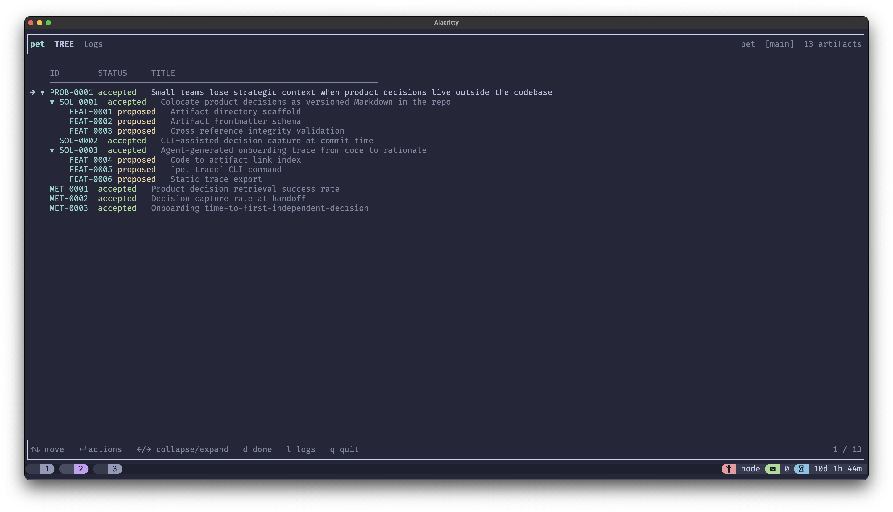
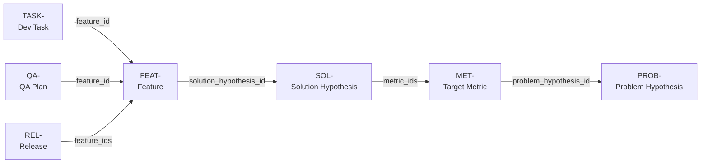

# pet - Product Engineering Toolkit

> Every decision from problem to shipped feature - in your repo.

---

`pet` implements **Layered Decision Records (LDR)** - a lightweight product development methodology that treats every product decision as an immutable, versioned record at the right level of abstraction.

LDR draws from three traditions:

- **Continuous Discovery** (Teresa Torres) - problems must be evidenced before solutions are designed; solutions must be validated before features are scoped
- **Hypothesis-Driven Development** - product ideas enter as falsifiable hypotheses, not requirements; evidence gates progression
- **Architecture Decision Records** (Michael Nygard) - once accepted, a decision is frozen and superseded rather than edited; the full history of what was believed, and why, stays in git

The distinctive constraint LDR adds: **context flows in one direction**. Each artifact level adds only what the level above doesn't provide - a solution record doesn't repeat the problem, a feature record doesn't repeat the solution rationale. No duplication, no cycles.

---

## The problem `pet` solves

When teams use AI to ship faster, they often hit a wall around week six. Simple changes break things unexpectedly. Nobody can explain why a particular approach was chosen, or remember which alternative was tried and abandoned. The code works. The _intent_ has gone missing.

This erosion of captured rationale - what Storey (2026) calls [intent debt](https://arxiv.org/abs/2603.22106) - accumulates silently alongside cognitive debt. Both accelerate with AI-assisted development.

---

## TUI



---

## How it works

**Decisions live in your repo.** Every hypothesis, feature, metric, and release plan is a markdown file under `doc/product/`. Versioned in git, reviewed in PRs, validated by CI.

**Decisions are immutable.** Once accepted, an artifact's body is never edited. When it turns out to be wrong, a new artifact supersedes it. The full history of what the team believed, and why, stays in git forever.

**Agents don't carry state.** Each invocation reads the current artifacts, computes the next step, and acts once - same pattern as a Kubernetes reconciler. No daemon, no long-running process.

---

## Artifact chain

Each level unlocks the next. Arrows show which artifact holds the foreign key:



Each artifact type carries only the sections relevant to its level:

| Record                     | Sections                      | Mutable?      |
| -------------------------- | ----------------------------- | ------------- |
| `PROB-` Problem hypothesis | Context, Evidence             | proposed only |
| `MET-` Target metric       | Decision, How we measure      | proposed only |
| `SOL-` Solution hypothesis | Decision, Success criteria    | proposed only |
| `FEAT-` Feature            | Decision, Acceptance criteria | proposed only |
| `TASK-` Dev task           | _(free-form)_                 | always        |
| `QA-` QA plan              | _(free-form)_                 | proposed only |
| `REL-` Release plan        | _(free-form)_                 | proposed only |

CI enforces schema validity, FK integrity, and the immutability rule on accepted artifacts.

---

## A cycle in practice

```bash
# You notice checkout abandonment is spiking
pet new hypothesis "Users abandon checkout because shipping cost is shown too late"
# -> PROB-0001

pet discover --hypothesis PROB-0001
# -> Researcher fills evidence; SolutionDesigner drafts SOL-0001

pet accept hypothesis PROB-0001
pet accept solution-hypothesis SOL-0001

pet discover --solution-hypothesis SOL-0001
# -> FeatureDesigner creates FEAT-0001

pet accept feature FEAT-0001
pet deliver --feature FEAT-0001
# -> Architect writes ADRs; TechLead creates TASK-0001...TASK-0004

# Implement, then:
pet qa --feature FEAT-0001
pet new release --features FEAT-0001 "v1.3"
pet release --release REL-0001
pet accept release REL-0001
```

Six months later, a new engineer asks: "Why do we show shipping cost on the product page?" They read PROB-0001 -> SOL-0001 -> FEAT-0001. Not because someone remembered to write a wiki page - because the pipeline forced the answer to be written down at the moment it was decided.

---

## Agent hierarchy

```
Orchestrator  (pet / pet chat - interactive dialogue)
+-- DeliveryLead
|   +-- Architect    writes ADRs, clears architectural review
|   +-- TechLead     decomposes features into tasks
|   +-- Dev          enriches task body with implementation approach
|   +-- QA           creates QA plan
|   +-- DevOps       adds deployment checklist to release
+-- DiscoveryLead
    +-- Researcher       fills evidence on a problem hypothesis
    +-- SolutionDesigner drafts SOL- for an accepted PROB-
    +-- FeatureDesigner  drafts FEAT- for an accepted SOL-
    +-- Analyst          drafts PROB- for a target metric
```

HITL gates are required before `hypothesis -> accepted`, `qa-plan -> accepted`, and `release -> accepted`. No agent promotes its own output past a gate.

---

## Stack

- **Runtime:** Node.js 20+ / TypeScript strict
- **Agent harness:** `deepagents`
- **LLM:** multi-provider via LangChain (`anthropic` default; `openai`, `bedrock`, `vertex`, `ollama` via `PET_LLM_PROVIDER`)
- **Schemas:** Zod, **CLI:** commander, **Error handling:** neverthrow

## Getting started

```bash
git clone https://github.com/smirnoffmg/pet
cd pet
npm install && npm run build && npm link
```

---

> _Informed by Storey, M.-A. (2026). "From Technical Debt to Cognitive and Intent Debt." [arXiv:2603.22106](https://arxiv.org/abs/2603.22106)_

[MIT License](./LICENSE)
